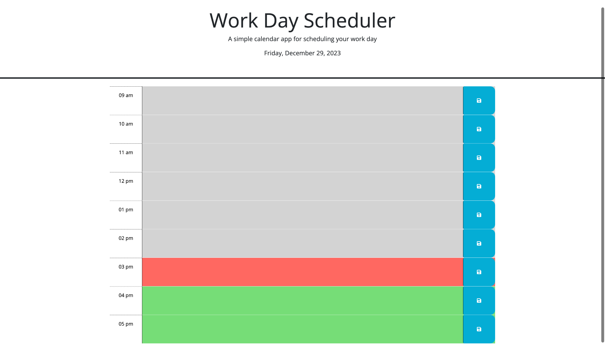

# Daily-Planner
## Description
In this project we were given some code to expand on in order to create a daily planner. The planner shows an accurate date and time time blocks for each houe within a standard work day 9am-5pm. Within the hour time blocks the user can enter events or information to help plan out their day and save that information to the browser for future review. 

## Repository

Link to deployed code:  <https://github.com/shannontice/Daily-Planner>

## Technologies

 - This is written with HTML5 and CSS 
 - HTML follows semantic structure for SEO
 - Refactor CSS for faster loading and efficiency
 - JavaScript was utilized to allow user to interact with the browser and all the user to input information into the planner
 - Dayjs was used to provide accurate time and date information on the site.
 - Local Storage keeps the information that has been saved in the planner and allows the user to get that information back even if the browser has been closed out or refreshed.

## Mock-Up

The following image shows the web application's appearance and functionality:
